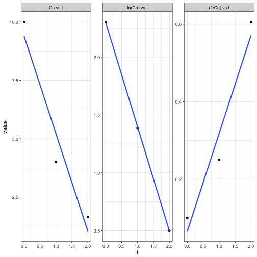

#This is the work for ENVE 660 Final Exam

Tyler Bradley
2018-03-11
---


```r
library(tidyverse)
```

##Probelm #4
Find k and n from the equation q = k*C^n, given the follwoing data


```r
data <- tribble(
  ~c, ~q,
  1.9, 6.2,
  21, 22.5,
  42.3, 33
) %>% 
  mutate(
    ln_q = log(q),
    ln_c = log(c)
  )

model <- lm(ln_q ~ ln_c, data = data) %>% 
  broom::tidy()
```

the intercept of the model gives log(k)


```r
exp(model$estimate[[1]])
```

```
## [1] 4.385541
```

the slope gives n


```r
model$estimate[[2]]
```

```
## [1] 0.5382244
```

##Problem #6
find k (and units)


```r
n <- 1.3

data_6 <- tribble(
  ~t, ~Ca,
  0, 10, 
  1, 4.0, 
  2, 1.65
) %>% 
  mutate(
    ln_Ca = log(Ca), # log() function defaults to ln()
    Ca_inv = (1/Ca)
  )
```

Plotting zero, first, and second order relationships between Ca and t


```r
data_6 %>% 
  gather(key = order, value = value, Ca:Ca_inv) %>% 
  mutate(order = factor(order, levels = c("Ca", "ln_Ca", "Ca_inv"),
                        labels = c("Ca vs t", "ln(Ca) vs t", "(1/Ca) vs t"))) %>% 
  ggplot(aes(t, value)) +
  facet_wrap(~ order, scales = "free") +
  geom_point() +
  geom_smooth(method = "lm", se = FALSE) +
  theme_bw()
```




```r
lm(ln_Ca ~ t, data = data_6) %>% 
  broom::tidy()
```

```
##          term   estimate   std.error statistic     p.value
## 1 (Intercept)  2.2974565 0.011467920  200.3377 0.003177707
## 2           t -0.9009049 0.008883013 -101.4188 0.006276931
```

