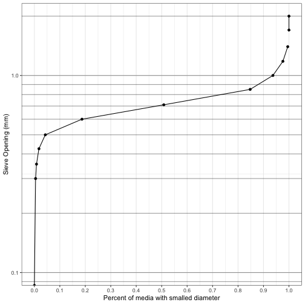

```r
# ENVE 661 - HW 4 - Question 11-1 (D)
library(tidyverse)

df <-tribble(
  ~opening, ~weight_retained,
  2.36, 0, 
  2, 0, 
  1.7, 0,
  1.4, 4,
  1.18, 16, 
  1, 33, 
  0.85, 75, 
  0.71, 285, 
  0.6, 270,
  0.5, 121, 
  0.425, 21, 
  0.355, 8, 
  0.3, 3, 
  0, 4
)

df %>% 
  mutate(weight_total = sum(weight_retained),
         perc_retained = weight_retained/weight_total,
         cum_perc_larger = cumsum(perc_retained),
         cum_perc_smaller = 1 - cum_perc_larger) %>% 
  ggplot(aes(cum_perc_smaller, opening)) + 
  geom_point() + 
  geom_line() + 
  theme_bw() +
  scale_x_continuous(breaks = seq(0, 1, 0.1)) +
  scale_y_log10(breaks = scales::log_breaks(n = 50),
                limits = c(0.1, 2)) +
  annotation_logticks(sides = "l", short = unit(30, "cm"),
                      long = unit(30, "cm"), 
                      mid =  unit(30, "cm"),
                      alpha = 0.4) +
  labs(x = "Percent of media with smalled diameter",
       y = "Sieve Opening (mm)")
```

```
## Warning: Transformation introduced infinite values in continuous y-axis

## Warning: Transformation introduced infinite values in continuous y-axis
```

```
## Warning: Removed 1 rows containing missing values (geom_point).
```



